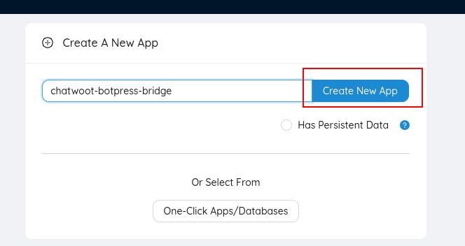
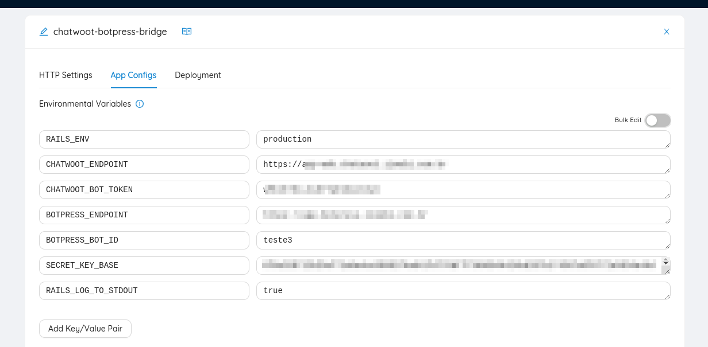
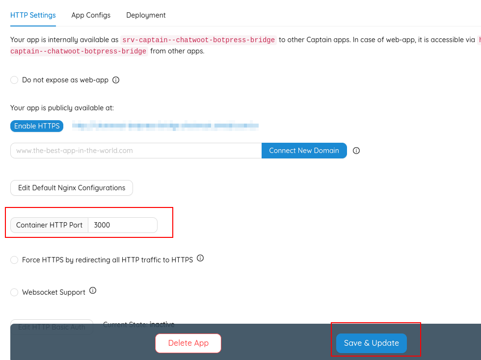
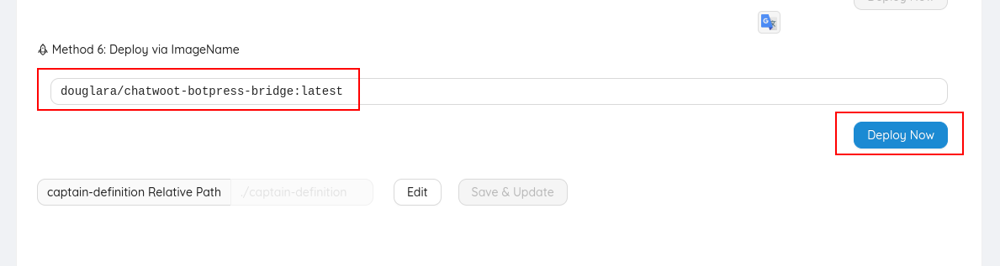

# About

This is a bridge connection chatwoot botpress.

[Chatwoot](https://github.com/chatwoot/chatwoot)
[Botpress](https://github.com/botpress/botpress)

# Running local

You need `ruby 3.2.2`
Clone this project:
```sh
git clone https://github.com/douglara/chatwoot-botpress-bridge.git
cd chatwoot-botpress-bridge
```

Copy configuration file:
```sh
cp .env.example .env
```

Edit vars in file `.env`:
```sh
BOTPRESS_ENDPOINT=
BOTPRESS_BOT_ID=
CHATWOOT_ENDPOINT=
CHATWOOT_BOT_TOKEN=
```

Install dependencies
```sh
bundle install
```


Start server:
```sh
rails s
```


# Running tests

```sh
rails test
```


#  Create an agent bot

Go to your chatwoot directory.  Start a rails console in your directory.

```
bundle exec rails c
```

Inside the rails console, type the following commands to create an agent bot and get its access token. Save the retrieved token as you would need it in further step.

```
bot = AgentBot.create!(name: "Botpress Bot", outgoing_url: "https://CHATWOOT_BOTPRESS_BRIDGE_URL/chatwoot/webhook")
bot.access_token.token
```

Connect Agent Bot to your inbox by running the following command

```
inbox = Inbox.last
AgentBotInbox.create!(inbox: inbox, agent_bot: bot)
```


# Deploy CapRover

1 - Create new app


2 - Configure env vars

```
RAILS_ENV=production
CHATWOOT_ENDPOINT=
CHATWOOT_BOT_TOKEN=
BOTPRESS_ENDPOINT=
BOTPRESS_BOT_ID=
SECRET_KEY_BASE=
```

Generate random SECRET_KEY_BASE with
```
rake secret
```



3 - Configure http port
In http settings set `Container HTTP Port` to `3000`


4 - Deploy container
In deployment settings set `Deploy via ImageName` with `douglara/chatwoot-botpress-bridge:1` and deploy now.



# Community to help

Telegram: https://t.me/chatwoot_botpress_bridge

# Articles

- Subindo um ambiente de desenvolvimento de Chatbot poderoso e open source:
https://www.linkedin.com/pulse/subindo-um-ambiente-de-desenvolvimento-chatbot-poderoso-douglas-lara/
- Chatbot simples de integrar com qualquer API
https://www.linkedin.com/pulse/chatbot-simples-de-integrar-com-qualquer-api-douglas-lara/
